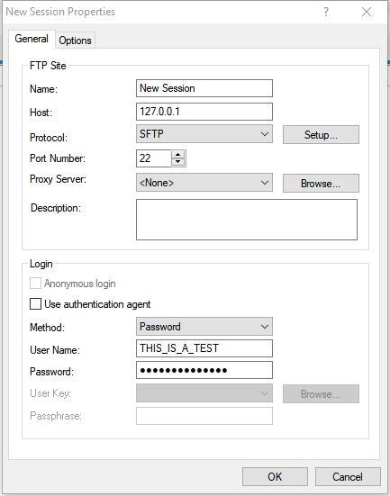
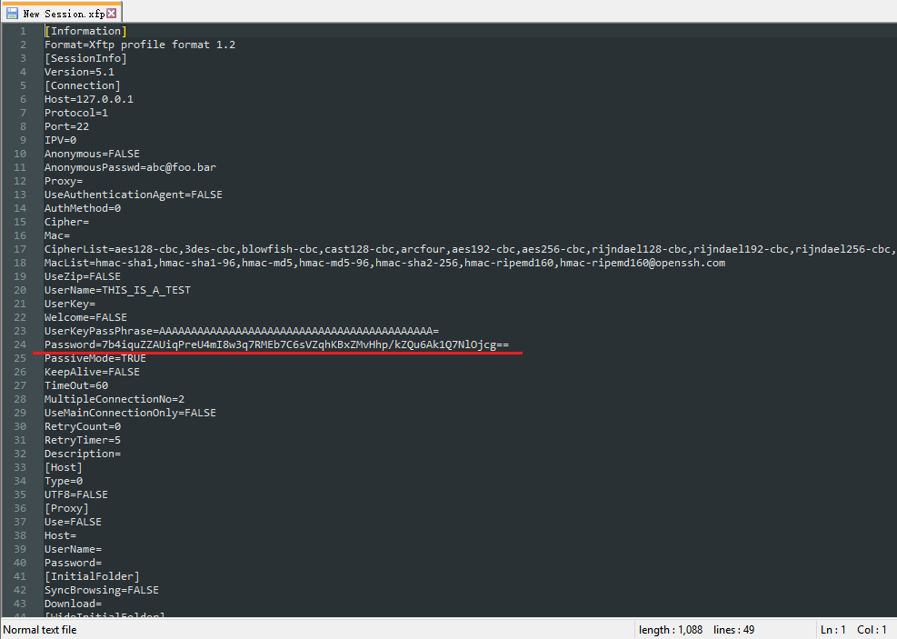

# How Does Xmanager Encrypt password?

## 1. What is Xmanager?

Xmanager is the market's leading PC X server that brings the power of X applications to a Windows environment.

With Xmanager, X applications installed on remote UNIX based machines run seamlessly with Windows application side by side.

It provides a powerful session management console, easy-to-use X application launcher, X server profile management tool, SSH module and a high performance PC X server for securely accessing a remote and virtualized UNIX and Linux environment.

You can find its official website [here](https://www.netsarang.com/).

## 2. What does indicate that Xmanager encrypts password?

If you open XShell or XFtp in Xmanager and then create a new session, you will find a window like these below:




After you input your username and password then click "Ok", Xshell and Xftp will save your configuration at

|Product |Session File Location                                          |
|--------|:--------------------------------------------------------------|
|XShell 5|`%userprofile%\Documents\NetSarang\Xshell\Sessions`            |
|XFtp 5  |`%userprofile%\Documents\NetSarang\Xftp\Sessions`              |
|XShell 6|`%userprofile%\Documents\NetSarang Computer\6\Xshell\Sessions` |
|XFtp 6  |`%userprofile%\Documents\NetSarang Computer\6\Xftp\Sessions`   |


Here below is a sample session file created by Xftp 5:



You can find there is a field named `Password` and the value of this field seems to be encoded by Base64 (Yes, you are right).

And there is another field named `Version` which indicates how passwords are encrypted.

## 3. How does Xmanager encrypt password?

After disassembling Xmanager by IDA, I found Xmanager uses a stream cipher to encrypt password. The stream cipher is an RC4 stream cipher. The following will tell you what Xmanager did:

### 3.1. Generate key used in RC4 stream cipher

Based on the version of session files, the key is generated by different algorithms.

* __FOR SESSION FILE VERSION < 5.1__

  Both XShell and XFtp use MD5 algorithm to generate the key that will be used in RC4 cipher.

  1. XShell use the MD5 digest, 16 bytes long, of an ASCII string, `"!X@s#h$e%l^l&"`, as the RC4 key. The value is

     ```c
     // Key = MD5("!X@s#h$e%l^l&");
     unsigned char Key[16] = {
         0xba, 0x2d, 0x9b, 0x7e, 0x9c, 0xca, 0x73, 0xd1, 
         0x52, 0xb2, 0x67, 0x72, 0x66, 0x2d, 0xf5, 0x5e
     };
     ```

  2. XFtp use the MD5 digest, 16 bytes long, of an ASCII string, `"!X@s#c$e%l^l&"` which only has one different char with the string in XShell, as the RC4 key. The value is

     ```c
     // Key = MD5("!X@s#c$e%l^l&");
     unsigned char Key[16] = {
         0x30, 0x6e, 0x98, 0x35, 0xde, 0x92, 0x91, 0xd2, 
         0x27, 0xbb, 0x28, 0xb2, 0xf7, 0x2d, 0xca, 0x33
     };
     ```

* __FOR SESSION FILE VERSION == 5.1 OR 5.2__

  Both XShell and XFtp use SHA-256 algorithm to generate key.

  The key is the SHA-256 digest, 32 bytes long, of the current OS account's SID string. You can use `whoami /user` in Command Prompt to check your current OS account's SID string.

  For example, if your current OS account's SID string is
  
  ```  
  S-1-5-21-917267712-1342860078-1792151419-512
  ```
  the 32-bytes-long SHA-256 digest would be

  ```c
  unsigned char Key[32] = {
      0xCE, 0x97, 0xBE, 0xA9, 0x0C, 0x2A, 0x40, 0xB9,
      0x5C, 0xC0, 0x79, 0x74, 0x1D, 0xDC, 0x03, 0xCB,
      0x39, 0xAB, 0x3D, 0xE5, 0x26, 0x7A, 0x3B, 0x11,
      0x05, 0x4B, 0x96, 0x3C, 0x93, 0x6F, 0x9C, 0xD4
  };
  ```

* __FOR SESSION FILE VERSION > 5.2__

  This situation is similar with the former one(version 5.1 or 5.2). 
  
  The key is the SHA-256 digest of the combination of current OS account's name(case sensitive) and current OS account's SID string.

  For example, if your current OS account's name and SID are 
  
  ```
  Administrator
  S-1-5-21-917267712-1342860078-1792151419-512
  ```
  the key is the 32-bytes-long SHA-256 digest of the string `"AdministratorS-1-5-21-917267712-1342860078-1792151419-512"`:

  ```cpp
  unsigned char Key[32] = {
      0x8E, 0x12, 0x29, 0xDC, 0x1F, 0x34, 0x56, 0xB9,
      0xBB, 0xCD, 0x94, 0xC2, 0xAB, 0x0A, 0xF3, 0xB9,
      0x95, 0x96, 0x6F, 0x06, 0xE3, 0x9D, 0x24, 0x80,
      0x6A, 0x74, 0xCD, 0x7E, 0x0B, 0x69, 0xB3, 0x78
  };
  ```

* __FOR THE CASE WHERE USER HAS SET A MASTER PASSWORD__

  The key is the SHA-256 digest of the master key set by user.

  For example, if I set master password with `"123123"`, the key that will be used in RC4 cipher is

  ```c
  unsigned char Key[32] = {
    0x96, 0xca, 0xe3, 0x5c, 0xe8, 0xa9, 0xb0, 0x24,  
    0x41, 0x78, 0xbf, 0x28, 0xe4, 0x96, 0x6c, 0x2c, 
    0xe1, 0xb8, 0x38, 0x57, 0x23, 0xa9, 0x6a, 0x6b, 
    0x83, 0x88, 0x58, 0xcd, 0xd6, 0xca, 0x0a, 0x1e
  };
  ```

### 3.2. Calculate SHA-256 digest of original password

__This step will be executed for session file version >= 5.1 only.__

If your original password is `"This is a test"`, the SHA-256 digest would be:

```c
unsigned char Checksum[32] = {
    0xC7, 0xBE, 0x1E, 0xD9, 0x02, 0xFB, 0x8D, 0xD4,
    0xD4, 0x89, 0x97, 0xC6, 0x45, 0x2F, 0x5D, 0x7E,
    0x50, 0x9F, 0xBC, 0xDB, 0xE2, 0x80, 0x8B, 0x16,
    0xBC, 0xF4, 0xED, 0xCE, 0x4C, 0x07, 0xD1, 0x4E
};
```

This 32-bytes-long data will be regarded as the checksum and appended to the encrypted password.

### 3.3. Initialize cipher

Xmanager use the key generated to initialize RC4 cipher.

### 3.4. Encrypt password

Xmanager use the initialized RC4 cipher encrypt original password.

If the original password is "This is a test", the result would be

* __FOR SESSION FILE VERSION < 5.1__

  1. Encrypted by XShell
  
     ```c
     unsigned char EncryptedPassword[] = {
         0xff, 0xa2, 0x9a, 0x4e, 0xb2, 0xb0, 0x9b, 0x47, 
         0x26, 0x86, 0xbd, 0x32, 0x01, 0x64
     };
     ```

  2. Encrypted by XFtp
  
     ```c
     unsigned char EncryptedPassword[] = {
         0x4c, 0xf2, 0x92, 0x83, 0x44, 0x10, 0xea, 0x8e, 
         0xfd, 0xe6, 0xf9, 0xcf, 0x20, 0xcb
     };
     ```

* __FOR SESSION FILE VERSION == 5.1 OR 5.2__

  ```c
  unsigned char EncryptedPassword[] = {
      0x84, 0x83, 0x31, 0x23, 0x24, 0x37, 0x1D, 0xB2,
      0x6C, 0x54, 0x87, 0x5B, 0x6E, 0xE9
  };
  ```

* __FOR SESSION FILE VERSION > 5.2__

  ```c
  unsigned char EncryptedPassword[] = {
      0xCE, 0xFD, 0xB5, 0x3B, 0x5C, 0x78, 0xDE, 0xA4,
      0x6C, 0xDD, 0xCE, 0x4D, 0x72, 0x40
  };
  ```

* __FOR THE CASE WHERE USER HAS SET A MASTER PASSWORD__

  ```c
  unsigned char EncryptedPassword[] = {
      0x46, 0xb9, 0xb7, 0x3f, 0x70, 0x0b, 0xd2, 0x20, 
      0xd5, 0xee, 0x70, 0x5b, 0x4b, 0x66
  };
  ```

### 3.5. Append checksum to encrypted password

__This step will be executed for session file version >= 5.1 only.__

* __FOR SESSION FILE VERSION == 5.1 OR 5.2__
  
  ```c
  unsigned char FinalResult[] = {
      0x84, 0x83, 0x31, 0x23, 0x24, 0x37, 0x1D, 0xB2,
      0x6C, 0x54, 0x87, 0x5B, 0x6E, 0xE9, 0xC7, 0xBE,
      0x1E, 0xD9, 0x02, 0xFB, 0x8D, 0xD4, 0xD4, 0x89,
      0x97, 0xC6, 0x45, 0x2F, 0x5D, 0x7E, 0x50, 0x9F,
      0xBC, 0xDB, 0xE2, 0x80, 0x8B, 0x16, 0xBC, 0xF4,
      0xED, 0xCE, 0x4C, 0x07, 0xD1, 0x4E
  };
  ```

* __FOR SESSION FILE VERSION > 5.2__

  ```c
  unsigned char FinalResult[] = {
      0xCE, 0xFD, 0xB5, 0x3B, 0x5C, 0x78, 0xDE, 0xA4,
      0x6C, 0xDD, 0xCE, 0x4D, 0x72, 0x40, 0xC7, 0xBE,
      0x1E, 0xD9, 0x02, 0xFB, 0x8D, 0xD4, 0xD4, 0x89,
      0x97, 0xC6, 0x45, 0x2F, 0x5D, 0x7E, 0x50, 0x9F,
      0xBC, 0xDB, 0xE2, 0x80, 0x8B, 0x16, 0xBC, 0xF4,
      0xED, 0xCE, 0x4C, 0x07, 0xD1, 0x4E
  };
  ```

* __FOR THE CASE WHERE USER HAS SET A MASTER PASSWORD__

  ```c
  unsigned char FinalResult[] = {
      0x46, 0xb9, 0xb7, 0x3f, 0x70, 0x0b, 0xd2, 0x20, 
      0xd5, 0xee, 0x70, 0x5b, 0x4b, 0x66, 0xC7, 0xBE,
      0x1E, 0xD9, 0x02, 0xFB, 0x8D, 0xD4, 0xD4, 0x89,
      0x97, 0xC6, 0x45, 0x2F, 0x5D, 0x7E, 0x50, 0x9F,
      0xBC, 0xDB, 0xE2, 0x80, 0x8B, 0x16, 0xBC, 0xF4,
      0xED, 0xCE, 0x4C, 0x07, 0xD1, 0x4E
  };
  ```

### 3.6. Convert the final result to Base64 format.

Convert the final result to Base64 format. Then the base64 string will be stored into session file.

* __FOR SESSION FILE VERSION < 5.1__

  1. XShell
     ```
     /6KaTrKwm0cmhr0yAWQ=
     ```

  2. XFtp

     ```
     TPKSg0QQ6o795vnPIMs=
     ```

* __FOR SESSION FILE VERSION == 5.1 OR 5.2__

  ```
  hIMxIyQ3HbJsVIdbbunHvh7ZAvuN1NSJl8ZFL11+UJ+82+KAixa89O3OTAfRTg==
  ```

* __FOR SESSION FILE VERSION > 5.2__

  ```
  zv21O1x43qRs3c5NckDHvh7ZAvuN1NSJl8ZFL11+UJ+82+KAixa89O3OTAfRTg==
  ```

* __FOR THE CASE WHERE USER HAS SET A MASTER PASSWORD__

  ```
  Rrm3P3AL0iDV7nBbS2bHvh7ZAvuN1NSJl8ZFL11+UJ+82+KAixa89O3OTAfRTg==
  ```

## 4. How to use the sample code

Make sure that you have installed `Python3`.

Make sure that you have installed `pypiwin32`, `pycryptodome` module.

```
Usage:
    XShellCryptoHelper.py <-e | -d>
                          [-ver    ver_sting]
                          [-user   user_string]
                          [-sid    sid_string]
                          [-key    key_string]
                          <password_str | base64_str>

    <-e|-d>:                     Specify encryption(-e) or decryption(-d).

    [-ver ver_string]:           Specify version of session file.
                                 ver_string can be "5.1", "5.2", "6.0" and etc.
                                 If not specified, the latest version will be used.

    [-user user_string]:         Specify username. This parameter will be used if version > 5.2.
                                 If not specified, the current username will be used.

    [-sid sid_string]:           Specify SID. This parameter will be used if version >= 5.1.
                                 If not specified, the current user's SID will be used.

    [-key key_string]:           Specify user's master password.
                                 If specified, implicit "-ver 6.0"

    <password_str|base64_str>:   Plain password text or base64-encoded encrypted text.
```

```
Usage:
    XFtpCryptoHelper.py <-e | -d>
                        [-ver    ver_sting]
                        [-user   user_string]
                        [-sid    sid_string]
                        [-key    key_string]
                        <password_str | base64_str>

    <-e|-d>:                     Specify encryption(-e) or decryption(-d).

    [-ver ver_string]:           Specify version of session file.
                                 ver_string can be "5.1", "5.2", "6.0" and etc.
                                 If not specified, the latest version will be used.

    [-user user_string]:         Specify username. This parameter will be used if version > 5.2.
                                 If not specified, the current username will be used.

    [-sid sid_string]:           Specify SID. This parameter will be used if version >= 5.1.
                                 If not specified, the current user's SID will be used.

    [-key key_string]:           Specify user's master password.
                                 If specified, implicit "-ver 6.0"

    <password_str|base64_str>:   Plain password text or base64-encoded encrypted text.
```

Example:

1. Encrypt Password:

   ```
   $ XShellCryptoHelper.py -e -ver 5.0 "This is a test"
   /6KaTrKwm0cmhr0yAWQ=

   $ XFtpCryptoHelper.py -e -ver 5.0 "This is a test"
   TPKSg0QQ6o795vnPIMs=

   $ XShellCryptoHelper.py -e -ver 5.1 -sid S-1-5-21-917267712-1342860078-1792151419-512 "This is a test"
   hIMxIyQ3HbJsVIdbbunHvh7ZAvuN1NSJl8ZFL11+UJ+82+KAixa89O3OTAfRTg==

   $ XShellCryptoHelper.py -e -ver 5.3 -user Administrator -sid S-1-5-21-917267712-1342860078-1792151419-512 "This is a test"
   zv21O1x43qRs3c5NckDHvh7ZAvuN1NSJl8ZFL11+UJ+82+KAixa89O3OTAfRTg==

   $ XShellCryptoHelper.py -e -key 123123 "This is a test"
   Rrm3P3AL0iDV7nBbS2bHvh7ZAvuN1NSJl8ZFL11+UJ+82+KAixa89O3OTAfRTg==
   ```

2. Decrypt Password:

   ```cmd
   $ XShellCryptoHelper.py -d -ver 5.0 /6KaTrKwm0cmhr0yAWQ=
   This is a test

   $ XFtpCryptoHelper.py -d -ver 5.0 TPKSg0QQ6o795vnPIMs=
   This is a test

   $ XShellCryptoHelper.py -d -ver 5.1 -sid S-1-5-21-917267712-1342860078-1792151419-512 hIMxIyQ3HbJsVIdbbunHvh7ZAvuN1NSJl8ZFL11+UJ+82+KAixa89O3OTAfRTg==
   This is a test

   $ XShellCryptoHelper.py -d -ver 5.3 -user Administrator -sid S-1-5-21-917267712-1342860078-1792151419-512 zv21O1x43qRs3c5NckDHvh7ZAvuN1NSJl8ZFL11+UJ+82+KAixa89O3OTAfRTg==
   This is a test

   $ XShellCryptoHelper.py -d -key 123123 Rrm3P3AL0iDV7nBbS2bHvh7ZAvuN1NSJl8ZFL11+UJ+82+KAixa89O3OTAfRTg==
   This is a test
   ```
