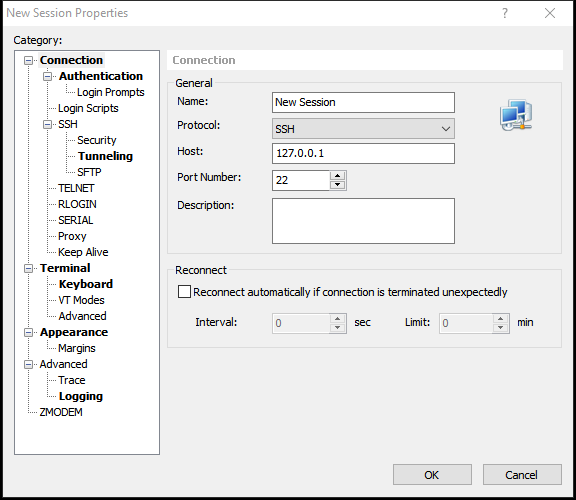

# How Does Xmanager Encrypt password?

This repo will tell you how Xmanager encrypts password and offer a tool to reveal passwords encrypted by Xmanager.

## 1. What is Xmanager?

Xmanager is the market's leading PC X server that brings the power of X applications to a Windows environment.

With Xmanager, X applications installed on remote UNIX based machines run seamlessly with Windows application side by side.

It provides a powerful session management console, easy-to-use X application launcher, X server profile management tool, SSH module and a high performance PC X server for securely accessing a remote and virtualized UNIX and Linux environment.

You can find its official website [here](https://www.netsarang.com/).

## 2. What does indicate that Xmanager encrypts password?

If you open Xshell or Xftp in Xmanager and then create a new session, you will find a window like:




After you input your username and password then click "Ok", Xshell and Xftp will save your configuration at

|Product |Session File Location                                          |
|--------|:--------------------------------------------------------------|
|XShell 5|`%userprofile%\Documents\NetSarang\Xshell\Sessions`            |
|XFtp 5  |`%userprofile%\Documents\NetSarang\Xftp\Sessions`              |
|XShell 6|`%userprofile%\Documents\NetSarang Computer\6\Xshell\Sessions` |
|XFtp 6  |`%userprofile%\Documents\NetSarang Computer\6\Xftp\Sessions`   |

The following is a sample session file created by Xftp 5:


You can find there is a field named `Password` and the value of this field seems to be encoded by Base64 (Yes, you are right).

And there is another field named `Version` which indicates how passwords are encrypted.

## 3. How does Xmanager encrypt password?

See [here](doc/how-does-Xmanager-encrypt-password.md).

## 4. How to use the sample code

Make sure that you have installed `Python3`.

Make sure that you have installed `pypiwin32`, `pycryptodome` module.

```
Usage:
    XShellCryptoHelper.py <-e | -d>
                          [-ver    ver_sting]
                          [-user   user_string]
                          [-sid    sid_string]
                          [-key    key_string]
                          <password_str | base64_str>

    <-e|-d>:                     Specify encryption(-e) or decryption(-d).

    [-ver ver_string]:           Specify version of session file.
                                 ver_string can be "5.1", "5.2", "6.0" and etc.
                                 If not specified, the latest version will be used.

    [-user user_string]:         Specify username. This parameter will be used if version > 5.2.
                                 If not specified, the current username will be used.

    [-sid sid_string]:           Specify SID. This parameter will be used if version >= 5.1.
                                 If not specified, the current user's SID will be used.

    [-key key_string]:           Specify user's master password.
                                 If specified, implicit "-ver 6.0"

    <password_str|base64_str>:   Plain password text or base64-encoded encrypted text.
```

```
Usage:
    XFtpCryptoHelper.py <-e | -d>
                        [-ver    ver_sting]
                        [-user   user_string]
                        [-sid    sid_string]
                        [-key    key_string]
                        <password_str | base64_str>

    <-e|-d>:                     Specify encryption(-e) or decryption(-d).

    [-ver ver_string]:           Specify version of session file.
                                 ver_string can be "5.1", "5.2", "6.0" and etc.
                                 If not specified, the latest version will be used.

    [-user user_string]:         Specify username. This parameter will be used if version > 5.2.
                                 If not specified, the current username will be used.

    [-sid sid_string]:           Specify SID. This parameter will be used if version >= 5.1.
                                 If not specified, the current user's SID will be used.

    [-key key_string]:           Specify user's master password.
                                 If specified, implicit "-ver 6.0"

    <password_str|base64_str>:   Plain password text or base64-encoded encrypted text.
```

Example:

1. Encrypt Password:

   ```
   $ XShellCryptoHelper.py -e -ver 5.0 "This is a test"
   /6KaTrKwm0cmhr0yAWQ=

   $ XFtpCryptoHelper.py -e -ver 5.0 "This is a test"
   TPKSg0QQ6o795vnPIMs=

   $ XShellCryptoHelper.py -e -ver 5.1 -sid S-1-5-21-917267712-1342860078-1792151419-512 "This is a test"
   hIMxIyQ3HbJsVIdbbunHvh7ZAvuN1NSJl8ZFL11+UJ+82+KAixa89O3OTAfRTg==

   $ XShellCryptoHelper.py -e -ver 5.3 -user Administrator -sid S-1-5-21-917267712-1342860078-1792151419-512 "This is a test"
   zv21O1x43qRs3c5NckDHvh7ZAvuN1NSJl8ZFL11+UJ+82+KAixa89O3OTAfRTg==

   $ XShellCryptoHelper.py -e -key 123123 "This is a test"
   Rrm3P3AL0iDV7nBbS2bHvh7ZAvuN1NSJl8ZFL11+UJ+82+KAixa89O3OTAfRTg==
   ```

2. Decrypt Password:

   ```cmd
   $ XShellCryptoHelper.py -d -ver 5.0 /6KaTrKwm0cmhr0yAWQ=
   This is a test

   $ XFtpCryptoHelper.py -d -ver 5.0 TPKSg0QQ6o795vnPIMs=
   This is a test

   $ XShellCryptoHelper.py -d -ver 5.1 -sid S-1-5-21-917267712-1342860078-1792151419-512 hIMxIyQ3HbJsVIdbbunHvh7ZAvuN1NSJl8ZFL11+UJ+82+KAixa89O3OTAfRTg==
   This is a test

   $ XShellCryptoHelper.py -d -ver 5.3 -user Administrator -sid S-1-5-21-917267712-1342860078-1792151419-512 zv21O1x43qRs3c5NckDHvh7ZAvuN1NSJl8ZFL11+UJ+82+KAixa89O3OTAfRTg==
   This is a test

   $ XShellCryptoHelper.py -d -key 123123 Rrm3P3AL0iDV7nBbS2bHvh7ZAvuN1NSJl8ZFL11+UJ+82+KAixa89O3OTAfRTg==
   This is a test
   ```
