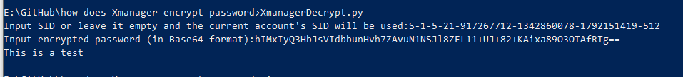

# How Does Xmanager Encrypt password?

## 1. What is Xmanager?
* Xmanager is the market's leading PC X server that brings the power of X applications to a Windows environment.
* With Xmanager, X applications installed on remote UNIX based machines run seamlessly with Windows application side by side.
* It provides a powerful session management console, easy-to-use X application launcher, X server profile management tool, SSH module and a high performance PC X server for securely accessing a remote and virtualized UNIX and Linux environment.
* You can find its official website [here](https://www.netsarang.com/).

## 2. What does indicate that Xmanager encrypts password?
* If you open Xshell or Xftp in Xmanager and then create a new session, you will find a window like these below:

    
    


* After you input your username and password then click "Ok", Xshell and Xftp will save your configuration at

    > __%userprofile%\\Documents\\NetSarang\\Xshell\\Sessions__

    or

    > __%userprofile%\\Documents\\NetSarang\\Xftp\\Sessions__

    Here below is an sample configuration file created by Xftp:

    

* You can find there is a field named "Password" in configuration file and the content of this field seems to be encoded by Base64 (Yes, you are right).

## 3. How does Xmanager encrypt password?
* After disassembling Xmanager by IDA, I find Xmanager use a stream cipher to encrypt password. The stream cipher is an RC4 stream cipher. Here below is what Xmanager did:

    ### 1. Generate key used in RC4 stream cipher.
    * Xmanager use SHA-256 hash algorithm to generate key.
    * The key is the SHA-256 digest of the current OS account's SID string.
    * You can use `whoami /user` in Command Prompt to check your current OS account's SID string.
    * For example if your current OS account's SID is `S-1-5-21-917267712-1342860078-1792151419-512`, the 32-bytes-long SHA-256 digest is
    ```cpp
    unsigned char Key[32] = { 0xCE, 0x97, 0xBE, 0xA9, 0x0C, 0x2A, 0x40, 0xB9, 0x5C, 0xC0, 0x79, 0x74, 0x1D, 0xDC, 0x03, 0xCB, 0x39, 0xAB, 0x3D, 0xE5, 0x26, 0x7A, 0x3B, 0x11, 0x05, 0x4B, 0x96, 0x3C, 0x93, 0x6F, 0x9C, 0xD4 };
    ```

    ### 2. Calculate SHA-256 digest of original password.
    * if your original password is "This is a test", the SHA-256 digest is:
    ```cpp
    unsigned char CheckCode[32] = { 0xC7, 0xBE, 0x1E, 0xD9, 0x02, 0xFB, 0x8D, 0xD4, 0xD4, 0x89, 0x97, 0xC6, 0x45, 0x2F, 0x5D, 0x7E, 0x50, 0x9F, 0xBC, 0xDB, 0xE2, 0x80, 0x8B, 0x16, 0xBC, 0xF4, 0xED, 0xCE, 0x4C, 0x07, 0xD1, 0x4E };
    ```
    * The 32-bytes-long data will be regarded as the check code appended to the encrypted password.

    ### 3. Initialize cipher.
    * Xmanager use the key generated to initialize RC4 cipher.

    ### 4. Encrypt password.
    * Xmanager use the initialized RC4 cipher encrypt original password.
    * If the original password is "This is a test", the result is:
    ```cpp
    unsigned char encrypted_pwd[] = { 0x84, 0x83, 0x31, 0x23, 0x24, 0x37, 0x1D, 0xB2, 0x6C, 0x54, 0x87, 0x5B, 0x6E, 0xE9 };
    ```

    ### 5. Append check code to encrypted password.
    * The final result is the encrypted password with the check code.
    * EXAMPLE:
    ```cpp
    unsigned char final_result[] = { 0x84, 0x83, 0x31, 0x23, 0x24, 0x37, 0x1D, 0xB2, 0x6C, 0x54, 0x87, 0x5B, 0x6E, 0xE9, 0xC7, 0xBE, 0x1E, 0xD9, 0x02, 0xFB, 0x8D, 0xD4, 0xD4, 0x89, 0x97, 0xC6, 0x45, 0x2F, 0x5D, 0x7E, 0x50, 0x9F, 0xBC, 0xDB, 0xE2, 0x80, 0x8B, 0x16, 0xBC, 0xF4, 0xED, 0xCE, 0x4C, 0x07, 0xD1, 0x4E }
    ```

    ### 6. Convert the final result to Base64 format and store it in configuration file.
    * Convert the final result to Base64 format.
    * EXAMPLE: `hIMxIyQ3HbJsVIdbbunHvh7ZAvuN1NSJl8ZFL11+UJ+82+KAixa89O3OTAfRTg==`
    * Then store it to configuration file.

## 4. How to use XmanagerDecrypt.py
* Make sure that you have installed `Python3`.
* Make sure that you have installed `pypiwin32`, `pycryptodome` module.
* Just run it in Command Prompt:

